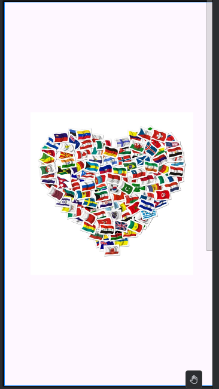
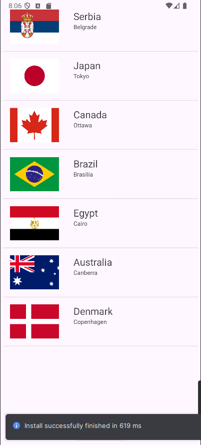
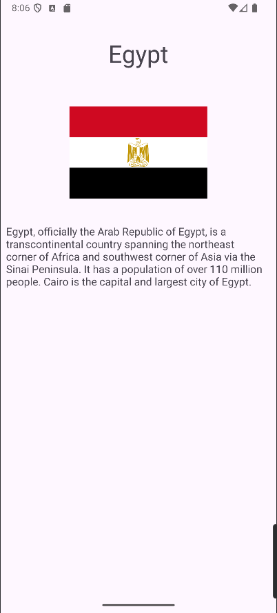
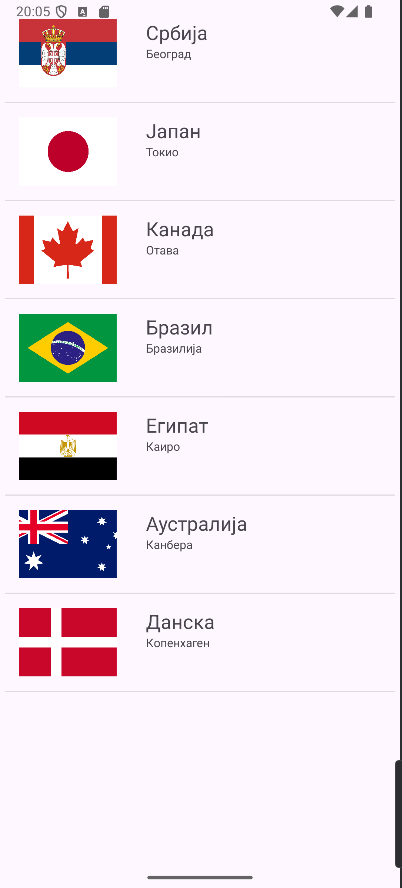
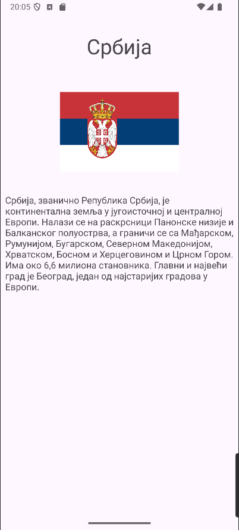

# 🌍 CountryListApp

A simple Android app that displays a list of countries, their capitals, and short descriptions. The app supports multiple languages, including Serbian (Latin and Cyrillic), and shows country flags.

---

## 📸 Screenshots

---

## 📁 Project Structure

| Folder | Description |
|--------|-------------|
| [`app/src/main/java/com/example/coutrylistapp`](app/src/main/java/com/example/coutrylistapp) | Main source code |
| [`app/src/main/res/layout`](app/src/main/res/layout) | XML UI layout files |
| [`app/src/main/res/values`](app/src/main/res/values) | Default string resources (English) |
| [`app/src/main/res/values-sr`](app/src/main/res/values-sr) | Serbian Cyrillic translations |
| [`app/src/main/res/drawable`](app/src/main/res/drawable) | Country flag images |
| [`taskImgs`](taskImgs) | Screenshots for documentation and tasks |

---
https://github.com/DavidK004/countryListApp/tree/main/app/src/main/java/com/example/coutrylistapp
